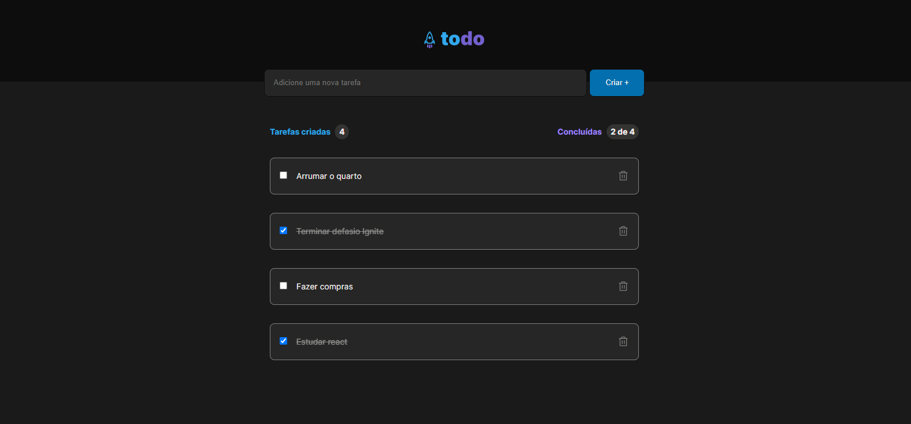

# Criando uma to-do list

   ## Criação de uma lista de tarefas similar ao <a href=https://www.figma.com/file/0n0zDN7zbzhRbaEO74Xesx/ToDo-List/duplicate> LayoutFigma</a> disponibilizado para a realização do desafio
 
  Esse era um projeto simples, mas que proporcionou aprendizados e uma fixação de conteudo excelentes
  ##
 <strong> Funcionalidades : </strong>
  
  <li> Adicionar uma nova tarefa</li> 
  <li> Marcar e desmarcar uma tarefa como concluída</li> 
  <li> Remover uma tarefa da listagem</li> 
  <li> Mostrar o progresso de conclusão das tarefas </li> 
     
   <strong> Conteios aplicados :</strong>
          
  <li> Estados</li> 
  <li> Imutabilidade do estado</li> 
  <li> Listas e chaves no ReactJS</li> 
  <li> Propriedades</li> 
  <li> Componentizaçã</li> 
  
  <h1 align="center">
  
</h1>

### Pré-requisitos

- npm install
- npm run dev
